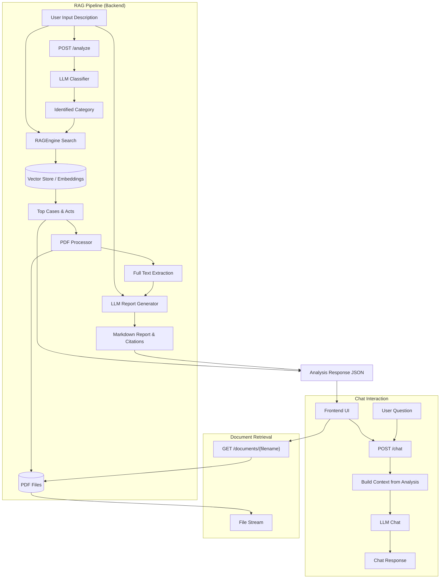

# System Pipeline & Architecture

This document outlines the data flow and architecture of the Legal RAG Backend.

## Architecture Diagram

## Pipeline Steps

### 1. Case Analysis (`/analyze`)
1.  **Input**: The user provides a natural language description of their legal situation.
2.  **Classification**: The `LLMClient` classifies the description into a specific legal category (e.g., "Criminal Law", "Environment", "Corporate Law") to narrow down the search scope.
3.  **Retrieval (RAG)**:
    *   The `RAGEngine` converts the user description into an embedding vector.
    *   It performs a cosine similarity search against pre-computed embeddings of Supreme Court Judgements and Indian Legal Acts.
    *   The search is filtered/prioritized based on the identified category.
4.  **Full Text Extraction**:
    *   For the top retrieved cases and acts, the `PDFProcessor` locates the corresponding PDF files on the disk.
    *   It extracts the full text content from these PDFs to provide rich context for the LLM.
5.  **Report Generation**:
    *   The `LLMClient` takes the user description and the full text of the retrieved documents.
    *   It generates a structured Markdown report containing:
        *   Executive Summary
        *   Relevant Legal Principles
        *   Application to the Case
        *   Recommendations
    *   It also extracts specific **Citations** with exact quoted text and file references.
6.  **Response**: The API returns the structured data, including the report, citations, and metadata for relevant cases/acts (including PDF filenames).

### 2. Interactive Chat (`/chat`)
1.  **Contextualization**: The frontend sends the user's follow-up question along with the *context* received from the `/analyze` endpoint.
2.  **Response Generation**: The LLM uses the provided context (summaries, report, citations) to answer the user's question specifically regarding the analyzed case.

### 3. Document Access (`/documents/{filename}`)
*   The frontend can request the actual PDF files referenced in the citations or the relevant case list to display them to the user.
